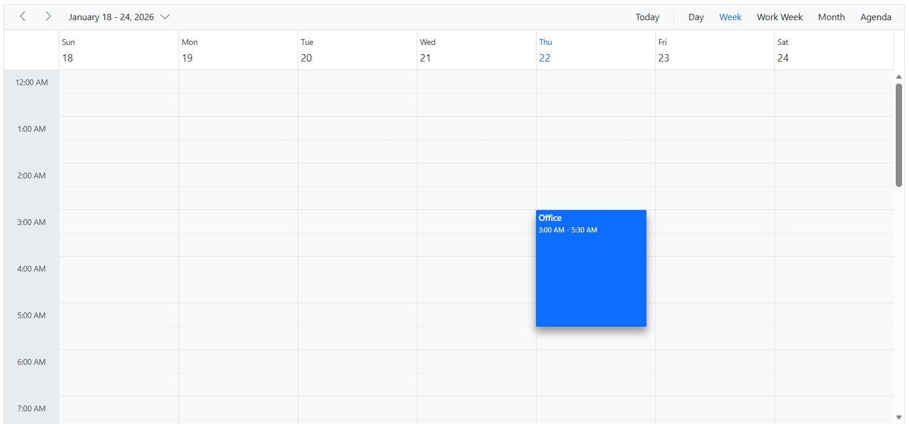
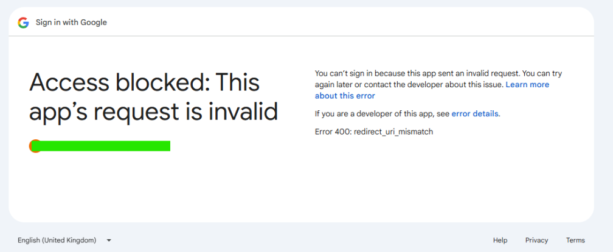
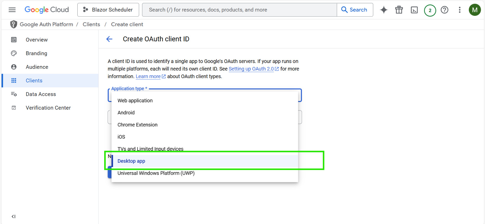

# Google calendar synchronization with Blazor Scheduler

This sample explains about how to synchronize the google calendar with Blazor Scheduler.

## Table of Contents
1. [Prerequisites](#prerequisites)
2. [Project Structure](#project-structure)
3. [Project setup](#project-setup)
4. [Running the Application](#running-the-application)
5. [Troubleshooting](#troubleshooting)
6. [Otuput](#output)

## Prerequisites
* NET SDK 9.x

## Project Structure
```bash
├── Readme.md                   # This guide
├── program.cs  						# App startup configuration
├── package.json						#JS dependencies
├── index.html							#Root HTML host
├── credentials.json					#File attached from the client id
├── imports.razor						#Global razor imports
├── pages
│    └── index.razor					#Schedule page
└── Data
     ├── Appointment.cs
     ├── GoogleService.csn    #Google calendar integration
     ├── WeatherForecast.cs
     └── WeatherForecastService.cs
```

## Project Setup
### Installation
1.Install the dotnet version 9 using the following commands.
```bash
1. winget install Microsoft.DotNet.SDK.9
2. dotnet new globaljson --sdk-version 9.0.100 --roll-forward latestFeature
```
Check the dotnet version using the following command
```bash
dotnet --version
```
### Restore Packages
1. Go to solution file.
2. Right click on the project.
3. Build the packages

## Running the Application

1. To run this application, we have to Turn on the Google Calendar API and DOWNLOAD CLIENT CONFIGURATION and save the file credentials.json in root directory. Refer below link to Turn on google calendar API.
```bash
https://developers.google.com/calendar/api/quickstart/js#step_1_turn_on_the
```
2. At the first time of running sample, it will attempt to open a new browser window, in that you have to authorize it.

3. **Blog**: [How to Synchronize Google Calendar with Syncfusion Blazor Scheduler](https://www.syncfusion.com/blogs/post/synchronize-google-calendar-with-syncfusion-blazor-scheduler.aspx)

## Output


## Troubelshooting
### Error 400: redirect_uri_mismatch

**Q: I keep getting "Error 400: redirect_uri_mismatch" when trying to authenticate with Google Calendar. How can I fix this?**

**A:** To resolve this error, create the OAuth Client ID as a "Desktop app" application type rather than a "Web application".

**Error Screenshot:**



**Solution:**

Select "Desktop app" as the application type when creating the OAuth client ID:

